<!-- _class: lead -->
<!-- _paginate: false -->
# Lecture 01A
## BIOL 351/451 Genetics
## Course Intro
## Dr. Neil Voss
## Aug 26, 2025

---

<!-- _class: lead -->
<!-- _paginate: false -->
# Instructor Information

---

# Professor Neil R. Voss

- **Dr. Neil Voss**, Associate Professor
- Email: nvoss@roosevelt.edu
- Office hours via Zoom: https://zoom.us/j/97638754024
  - Meeting ID: 976 3875 4024
  - Password: voss
- Favorite biology subjects: Biophysics, Structural Biology, and Electron Microscopy

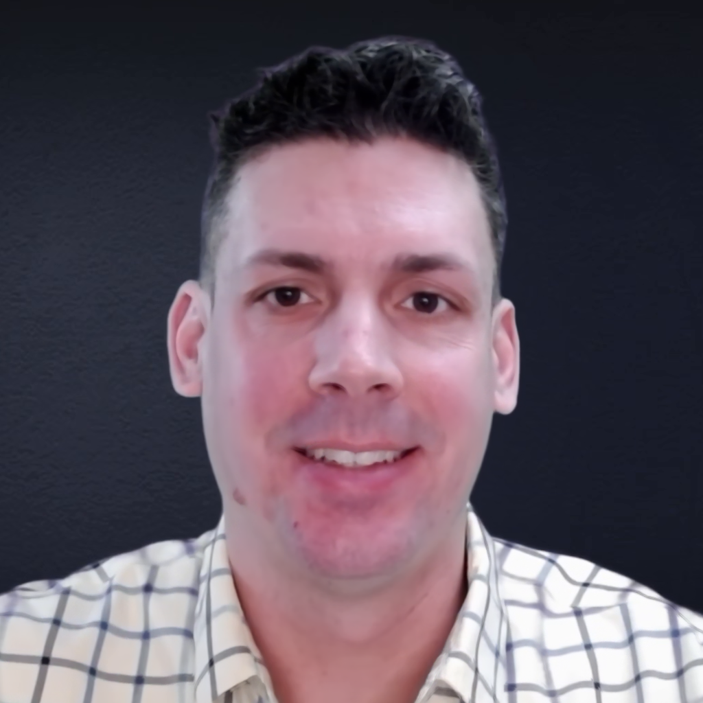

---

# Ways to Contact Dr. Voss

1. **Attend office hours**
2. **Discord** — fastest
   - Send me a direct message or post to the class
   - Typical response time: 1–2 calendar days
3. **Email**
   - I check email once per day
   - Typical response time: 2 business days
4. **Anonymous Google Form**
   - Typical response time: 2–4 business days

---

# Dr. Voss YouTube Channel

- https://www.youtube.com/c/NeilVossLab/videos
- a few videos for hard problems

---

# Discord Server

- I created a Discord Server called Neil Voss Lab
  - Participation in Discord is technically not required, but I give you are required to sign up
- Sign-up link is available on Blackboard
  - It is available as a mobile app, a desktop app, and a website
  - Be sure to connect to my server, you should not create your own server

---

# Discord Signup

- In Blackboard, open **Important Links**.
- Select **Join Discord Server Invite Link**.

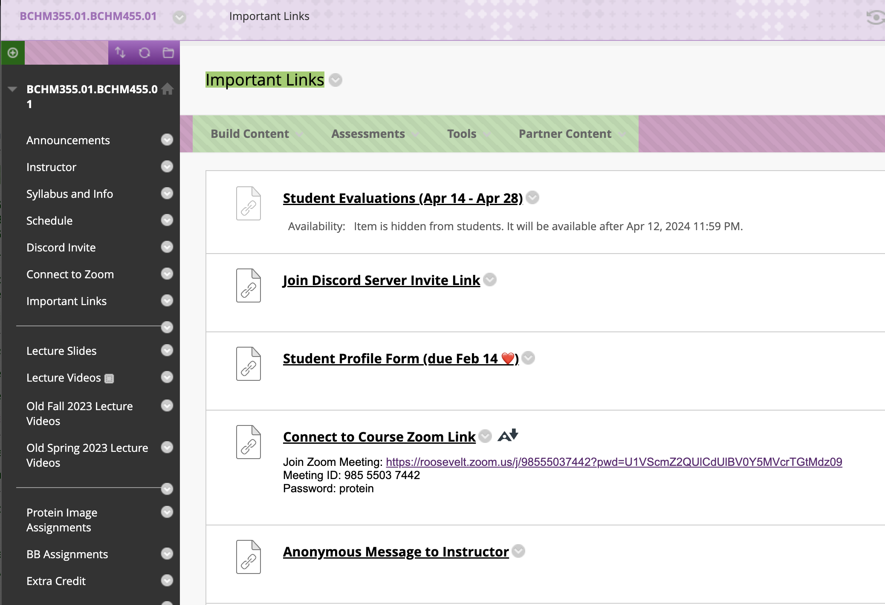

---

# Anonymous Message Form

- Send an anonymous message to the instructor.
- Use the new Google Form to send me an anonymous message.
- I took great care to make sure it is completely anonymous.
- The form sends your message directly to my email.
- https://forms.gle/gZ8nx28q9YDwSy8g7

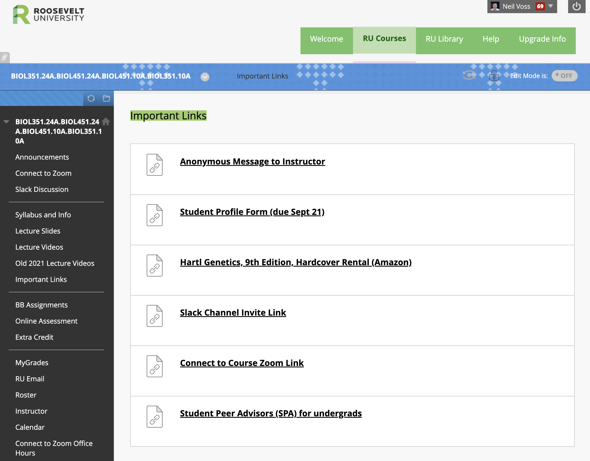

---

# Office Hours

- Via Zoom Video Conference:
- https://zoom.us/j/97638754024
- Meeting ID:
  - 976 3875 4024
- Password: voss
- To be determined
- also available by appointment

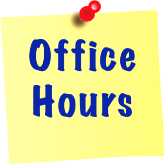

---

<!-- _class: lead -->
<!-- _paginate: false -->
# Course Information

---

# Textbooks for class

- **Do not buy** the eighth or ninth edition of Hartl and Ruvolo.
- We will use the free OER textbook on the next slide.

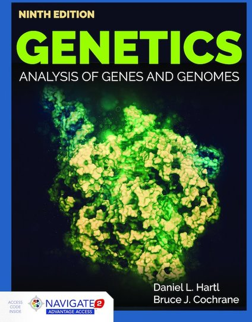

---

# New, Free OER Textbook for 2025

- Advanced Genetics: Mechanisms of Inheritance and Analysis
  - https://bio.libretexts.org/Courses/Roosevelt_University/Advanced_Genetics%3A_Mechanisms_of_Inheritance_and_Analysis
- Dr. Voss is creating his own custom textbook but it will take some time.
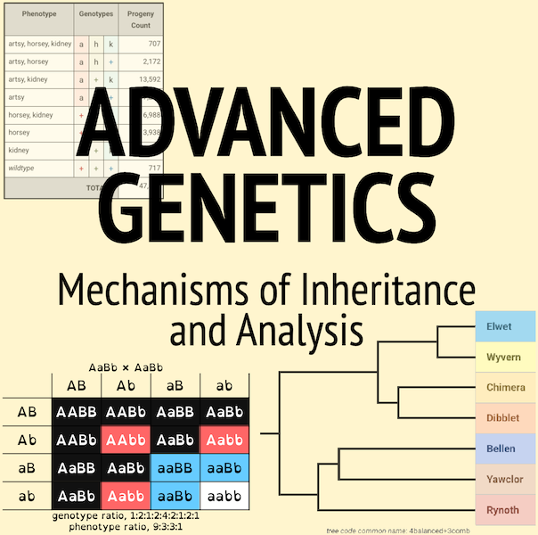

---

# Idiom: "build the plane while flying it"

- This idiom can also be applied in education when teachers try out new teaching methods or curriculums during actual classes with students. They may experiment with different approaches until they find what works best for their students.
- https://crossidiomas.com/build-the-plane-while-flying-it/
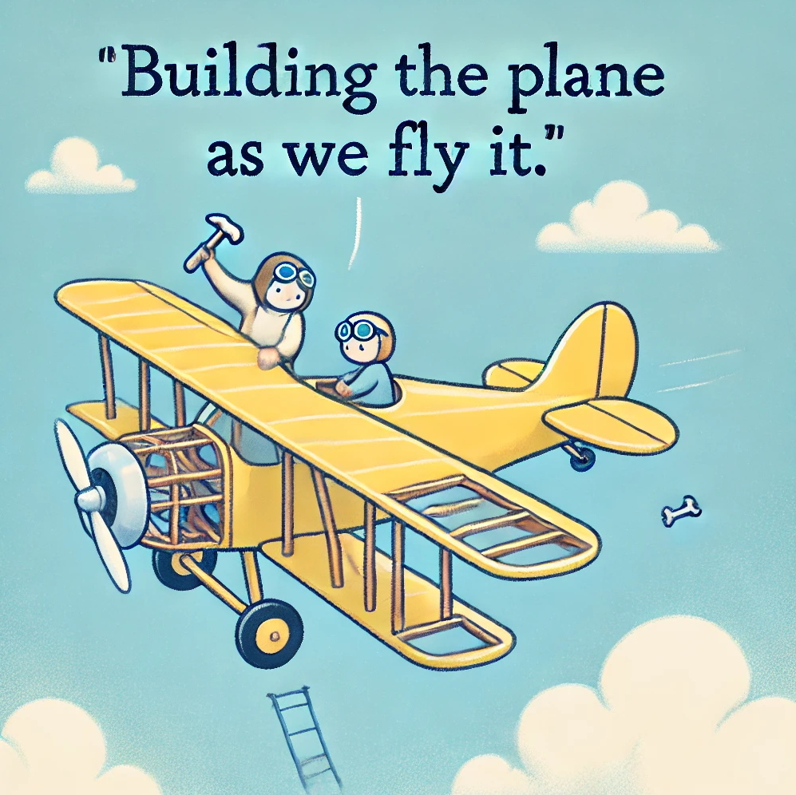

---

# Other Resources and Materials

- Khan Academy:
  - https://www.khanacademy.org/science/biology/classical-genetics
- Online Mendelian Inheritance: Catalog of Human Genetic Disorders
  - http://omim.org/

---

# How to be successful

- Attend class and arrive on time.
- Use Blackboard for lecture slides and other materials.
- Check your email for schedule changes and course updates.
- Read the book and review the lectures again.
- Review old exams to find where you went wrong.
- Come to office hours when you need help.

---

<!-- _class: lead -->
<!-- _paginate: false -->
# Blackboard

---

<!-- _class: figure -->

# Website: http://blackboard.roosevelt.edu

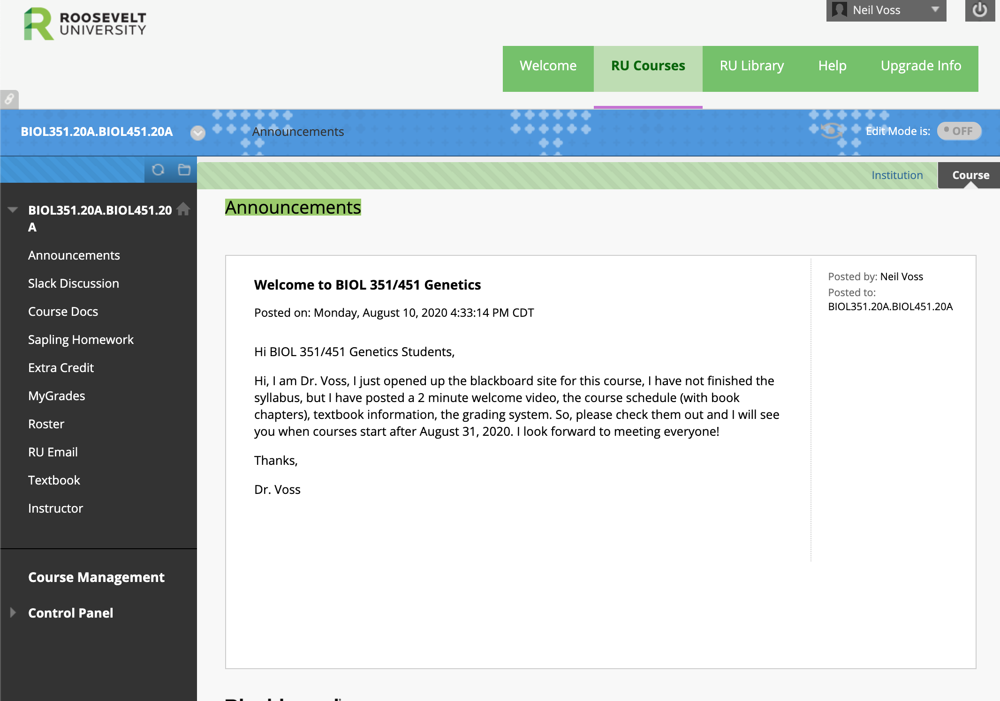

---

<!-- _class: lead -->
<!-- _paginate: false -->
# Course Policies

---

<!-- _class: lead -->
<!-- _paginate: false -->
# Other Required Credit

---

# Discord Server

- Discord Server:
  - Students will be awarded 2 points for simply signing up for the Discord Server.
  - Please use this method to contact the instructor rather than email.
- Due Within First Few Weeks of Class,
  - Due Sept 21.

---

# Discord Server

- I created a Discord Server called Neil Voss Lab
  - Participation in Discord is technically not required, but I give you are required to sign up
- Sign-up link is available on Blackboard
  - It is available as a mobile app, a desktop app, and a website
  - Be sure to connect to my server, you should not create your own server

---

# Discord Signup

- In Blackboard, open **Important Links**.
- Select **Join Discord Server Invite Link**.

---

# Student Profile

- Earn **3 points** for uploading your profile to Blackboard.
- Include a picture of your face.
- I will not publish it; I, tutors, and TAs use it to learn your name.
- Answer the questions on the next slide.

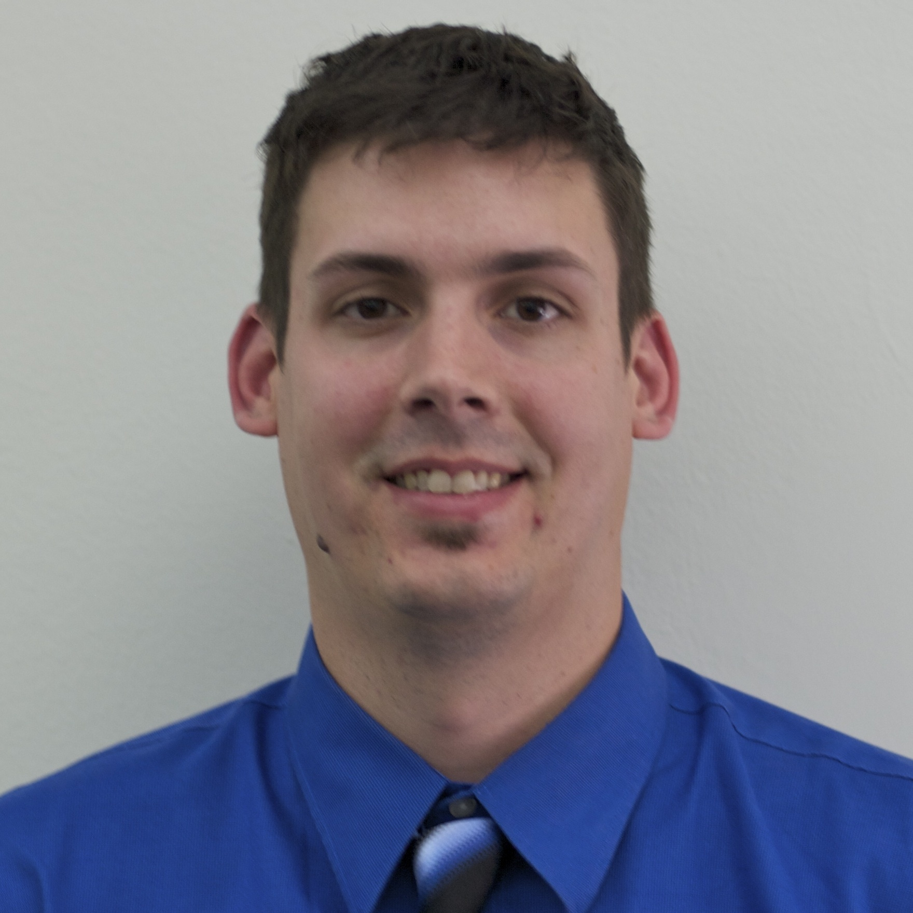

---

# Student Profile

- Include a picture of your face.
- Answer these questions about yourself:
  - What are your career goals?
  - What is your favorite biology subject?
  - What would you like to learn in this class?
  - What are you nervous about in this class?
  - What is your favorite local restaurant?
  - What is one interesting thing you did over the break?
- The Blackboard link is due **September 21**; no points are awarded after the deadline.

---

# Dr. Voss Profile

- Got my undergraduate degrees in Physics and Mathematics at Iowa State University. Really got into using physics techniques to solve biological questions.
- Got my Ph.D. in Molecular Biophysics and Biochemistry on the east coast. My thesis involved using computer to analyze protein structures.
- Did a Post-doc in San Diego on Cryo-electron microscopy. Basically take a bunch of pictures to solve a 3D structure of a protein.
- My favorite biology subject is Protein Structure, but right now my favorite class to teach is Genetics.

---

# Cryo-Electron Microscope

<!-- _class: gallery -->

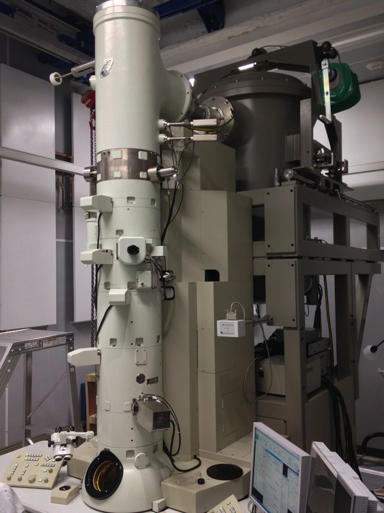 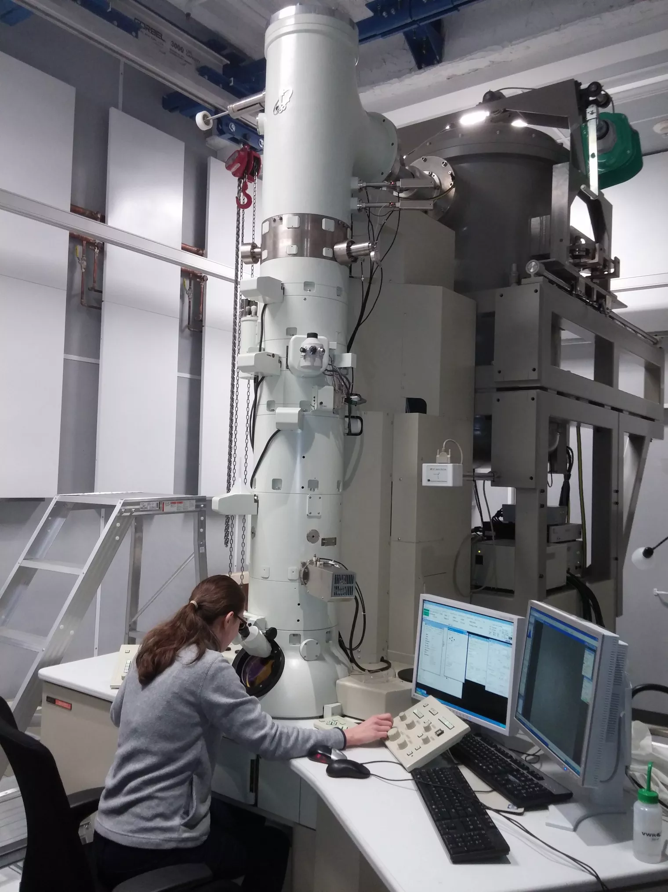 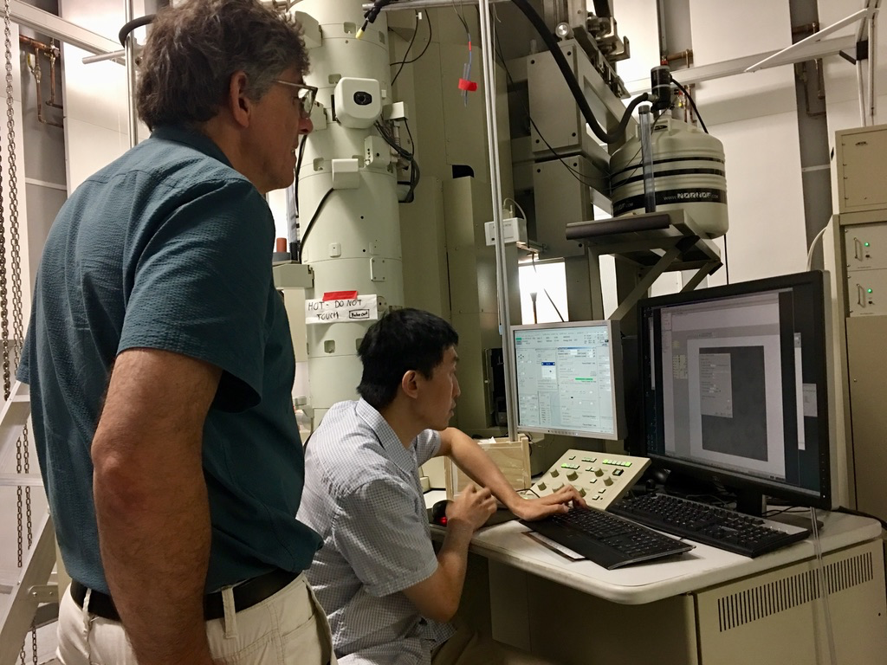

---

# Dr. Voss profile

- My favorite restaurant for a long time was India House at Golf and Higgins, but they closed.
- So now it is probably: Cafe Zupa's or Chef Ping
- I never know what my favorite color is, but my favorite M&M color is GREEN.
- Over the break, I have not done much besides feed and pick up after my kids. It has been exhausting.
  - Normally my hobbies are building Lego and watching movies

---

<!-- _class: two-pane -->

# Dr. Voss's Best Movies of the Decade

> ## Top 10
>
> - **1.** Blade Runner 2049 (2017)
> - **2.** Boyhood (2014)
> - **3.** The Big Sick (2017)
> - **4.** Spider-Man: Into the Spider-Verse (2018)
> - **5.** The Handmaiden (2016)
> - **6.** Mad Max: Fury Road (2015)
> - **7.** Scott Pilgrim vs. the World (2010)
> - **8.** Free Solo (2018)
> - **9.** The Grand Budapest Hotel (2014)
> - **10.** Contagion (2011)

> ## Honorable mentions
>
> - Inside Out (2015)
> - Private Life (2018)
> - Before Midnight (2013)
> - This Is 40 (2012)
> - The Descendants (2011)
> - Bumblebee (2018)
> - Edge of Tomorrow (2014)
> - Midnight in Paris (2011)
> - The Social Network (2010)
> - Looper (2012)
> - Drive (2011)
> - Ex Machina (2014)

---

<!-- _class: lead -->
<!-- _paginate: false -->
# General Announcements

---

# Graduating Students

- Last day to apply for graduation is:
  - September 2, 2025
- Late applications will cost you a $100 late fee

https://www.roosevelt.edu/current-students/academics/grad-prep
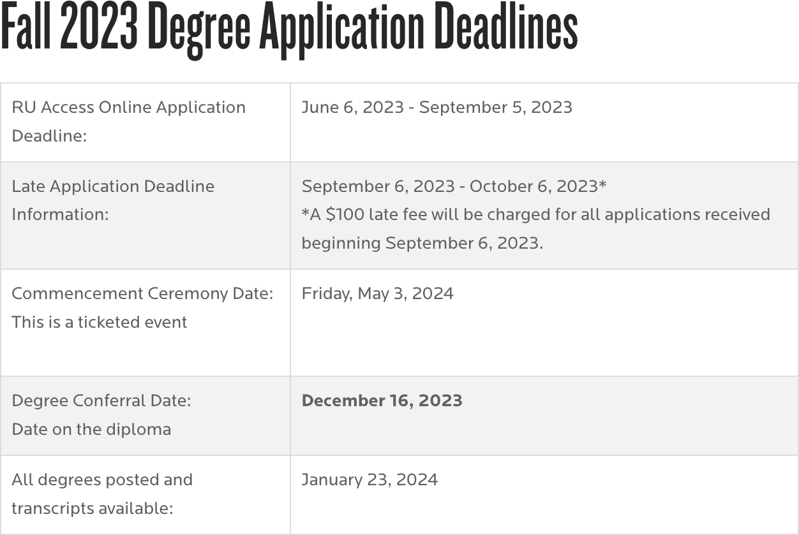

---

<!-- _class: lead -->
<!-- _paginate: false -->
# THE END

<!-- ODP hidden slide skipped: page19 -->

<!-- ODP hidden slide skipped: page20 -->

<!-- ODP hidden slide skipped: page21 -->

<!-- ODP hidden slide skipped: page22 -->

<!-- ODP hidden slide skipped: page23 -->

<!-- ODP hidden slide skipped: page24 -->

<!-- ODP hidden slide skipped: page25 -->

<!-- ODP hidden slide skipped: page38 -->

<!-- ODP hidden slide skipped: page39 -->
