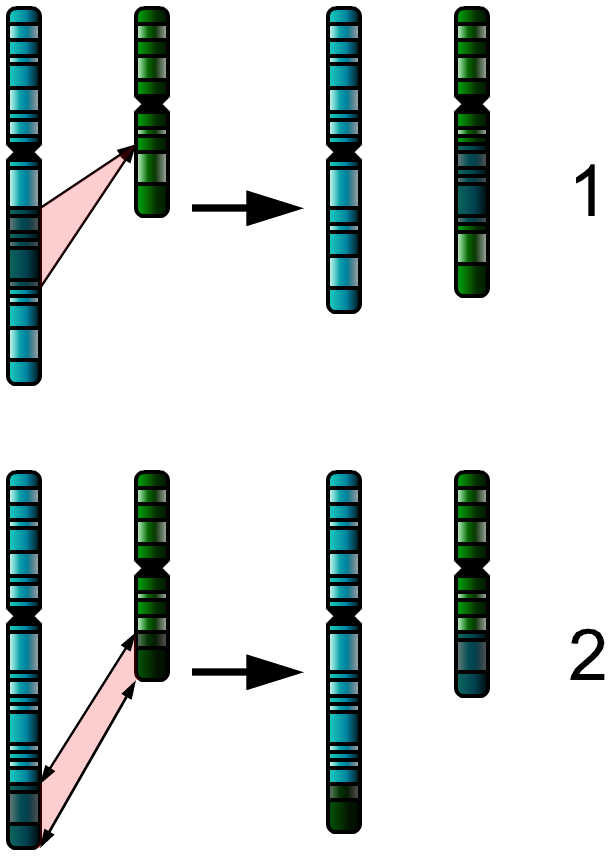
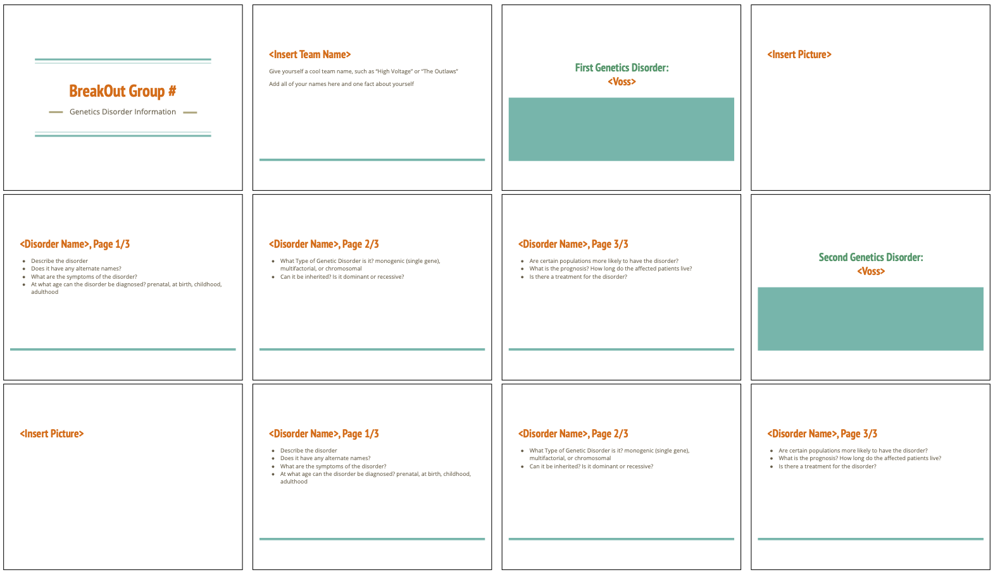
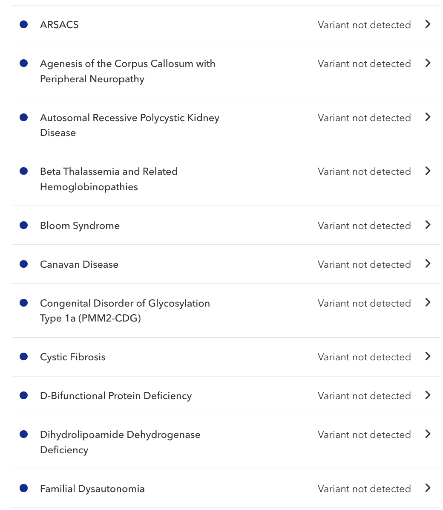
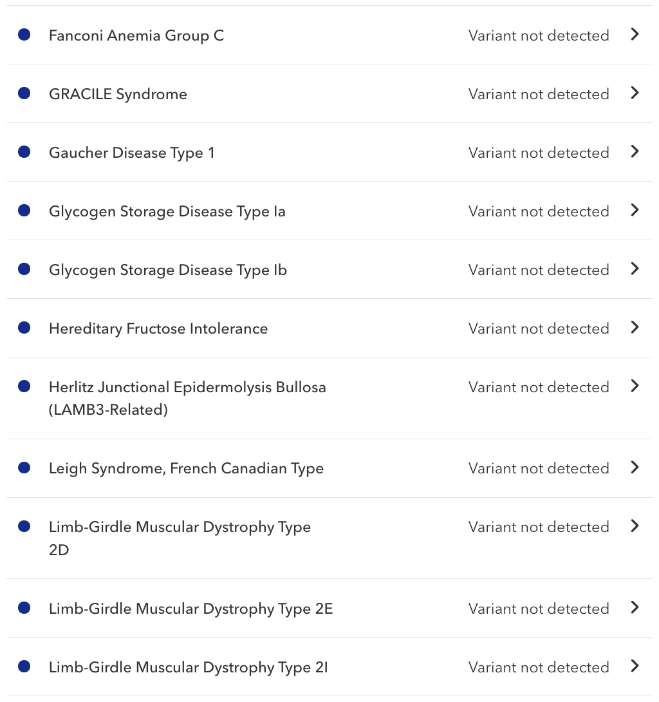
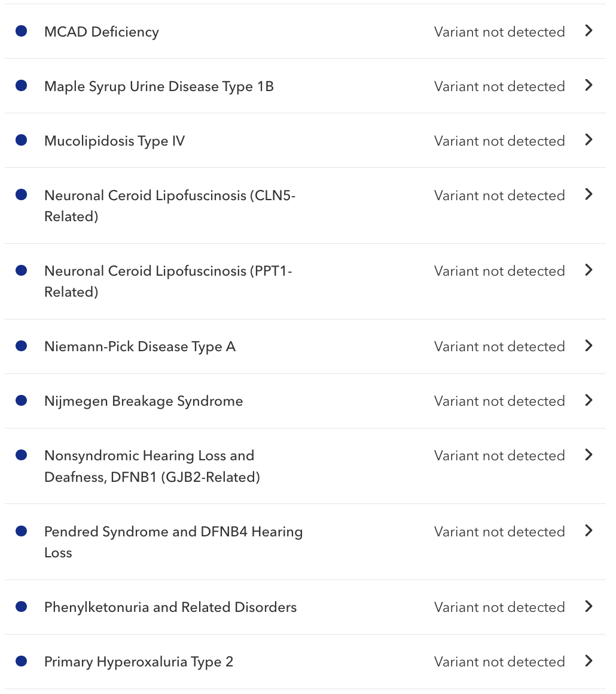
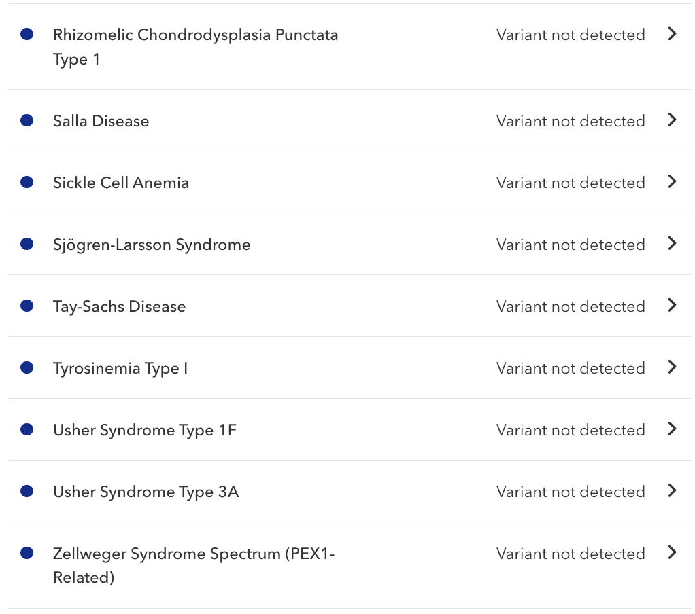

<!-- _class: lead -->
<!-- _paginate: false -->
# Lecture 1B
## Genetic Disorders
## Dr. Neil Voss
## Aug 26, 2025

---

<!-- _class: lead -->
<!-- _paginate: false -->
# What is a genetic disorder?

---

<!-- _class: lead -->
<!-- _paginate: false -->
# What is the difference between a disorder and a disease?

---

# Disease vs. Disorder

- A disease is a pathophysiological response to internal or external factors. Have a characteristic set of signs and symptoms. Used as labels for ill health. Such as heart disease.
- A disorder is a disruption to regular bodily structure and function. Can simply mean something is not working right. An irregular heartbeat is a disorder
- Diseases may cause disorders, and disorders can lead to diseases.

---

<!-- _class: lead -->
<!-- _paginate: false -->
# What is a genetic disorder?

---

# Genetic Disorder

- A genetic disorder is a genetic problem caused by one or more abnormalities in the genome
  - Most genetic disorders are quite rare and affect one person in every several thousands or millions.
- Genetic disorders can be:
  - monogenic or single-gene
  - polygenic or multifactoral (many genes)
  - chromosomal

---

<!-- _class: lead -->
<!-- _paginate: false -->
# In terms of genetic disorders, what types of anomalies can happen to your DNA?

---

<!-- _class: split -->
# Types of Gene Disorders

- Point mutation
- Chromosome abnormalities:
  - Deletion
  - Duplication
  - Translocation
  - Inversion

---

# Genetics Disorder Activity

- I will create random breakout rooms of 4-5 students
- Introduce yourselves and answer:
  - is your favorite dessert sweet, salty, or sour?
- Each group will receive two genetic disorders
- As a team make a quick Google Slideshow on your disorder
  - Requires google/gmail account

---

# Genetics Disorder Activity

- Do the following for each item:
  - Describe the disorder
  - What Type of Gene Disorder is it? monogenic (single gene), multifactoral, or chromosomal
  - What are the symptoms of the disorder?
  - Can it be inherited? Is it dominant or recessive?
  - At what age can the disorder be diagnosed? Pre-natal, at birth, childhood, adulthood
  - Are certain populations more likely to have the disorder?
  - What is the prognosis? How long do the affected patients live?
  - Is there a treatment for the disorder?

---

---

<!-- _class: source-fallback -->
<!-- _paginate: false -->

<!--
ODP source text
- Import fallback: dense text layout
- Genetic Disorders
- Primarily monogenic disorders
- Achondroplasia
- Alkaptonuria
- Beta-Thalassemia
- Congenital Adrenal Hyperplasia
- Cystic fibrosis
- Duchenne muscular dystrophy
- Fabry Disease
- Fragile X syndrome
- Galactosemia
- Hemophilia
- Huntington's disease
- Hyper IgM Syndrome
- Maple syrup urine disease
- Marfan syndrome
- Methylmalonic Acidemia
- Phenylketonuria
- Sickle-cell anemia
- Tay&#8211;Sachs disease
- Wilson's Disease
- Chromosomal disorders
- Angelman syndrome
- Beckwith-Wiedemann Syndrome
- Cri du chat
- DiGeorge syndrome
- Down syndrome
- Edward&#8217;s syndrome
- Jacobsen Syndrome
- Klinefelter syndrome
- Miller-Dieker Syndrome
- Pallister-Killian Syndrome
- Patau syndrome
- Philadelphia chromosome
- Prader-Willi syndrome
- Ring Chromosome 14 Syndrome
- Smith-Magenis Syndrome
- Triple X syndrome
- Turner syndrome
- WAGR syndrome
- Williams Syndrome
- Wolf-Hirschhorn syndrome
- https://en.wikipedia.org/wiki/List_of_genetic_disorders
- https://www.genome.gov/10001204/specific-genetic-disorders/
-->

---

<!-- _class: source-fallback -->
<!-- _paginate: false -->

<!--
ODP source text
- Import fallback: dense text layout
- Fall 2024
- Locked Group 01: https://docs.google.com/presentation/d/1qx5Qn5MLNHvXJ9lD_VE70a9fnriMF_XgArIAZv_0rs0/edit
- Group 02: https://docs.google.com/presentation/d/1QSwy4dJ1dfHVpKe3vlj0Xmzr1uW1IkkUHXJxGOeAf58/edit
- Group 03: https://docs.google.com/presentation/d/11kf9pG133KFqVbijAqoDBlqw3TvAc7iN1tuiSIUXPwA/edit
- Group 04: https://docs.google.com/presentation/d/1u0ZkkZzxbiUnnMDiFF5ahm-vUUtKUoP2gF8v9PQ8Wwk/edit
- Group 05: https://docs.google.com/presentation/d/1RtHu90bZuE0kQ2NOEMpBw3yn1XtDmD8u0ECWt3OZMZQ/edit
- Group 06: https://docs.google.com/presentation/d/1mzacyNkuHc9akjkJEXG8w9hW4upN1yU6GUb30xLJmTA/edit
- Group 07: https://docs.google.com/presentation/d/1b-n3uqYX1lUL6oyeUAsH6ajImRv7KAqfpkV9Pjzz6m8/edit
- Group 08: https://docs.google.com/presentation/d/1iFZrit0nnDpXCdnPf6UQ05RysWbSW9QbiwK5R7Sc9fQ/edit
- Group 09: https://docs.google.com/presentation/d/1EBzZnAI4Ct6ruT-VVBD9WtQ87Cn1Cc6er9QcNN6ks0w/edit
- Group 10: https://docs.google.com/presentation/d/1XssJC7TVAZ7rMa2nQQO9Cniz2kq0ZMooYwSLqPKRJ8I/edit
- Unused:
- Group 11: https://docs.google.com/presentation/d/1K1FXiQQT7p-HnoVt_yOz0B-p4By5S5gNl-rbqmnYcpY/edit
- Group 12: https://docs.google.com/presentation/d/1Lzxu6hUobQngrun2K9x9-HUNUfdE3jfWZbMLhJa1Geo/edit
-->

---

<!-- _class: source-fallback -->
<!-- _paginate: false -->

<!--
ODP source text
- Import fallback: dense text layout
- Import fallback: long text layout
- Fall 2023
- Group 01: https://docs.google.com/presentation/d/1HRMqmihTdeRE9kXulQamlCaALcuiBC4Bqqx5718a2f0/edit?usp=drivesdk
- Group 02: https://docs.google.com/presentation/d/1WOgESPpCSSXHdPnM78HVF39DdvPWr8bkM1k8nztiUwk/edit?usp=drivesdk
- Group 03: https://docs.google.com/presentation/d/1XaRuz2VLm9FpA3q8Hy1OkSuGO-HgYD6hzzJuyHH5e98/edit?usp=drivesdk
- Group 04: https://docs.google.com/presentation/d/1XFuZPw5832x_b8VOV5b86FKlVCaSYLC8FqxGbaFCSMU/edit?usp=drivesdk
- Group 05: https://docs.google.com/presentation/d/19bhG0BTrbD5tk4pEhK1pVdGhOBt7bzQVVbRCTVo6-sU/edit?usp=drivesdk
- Group 06: https://docs.google.com/presentation/d/1FGate-7a75aT8-_bmg-QT8IGWFTuTkZvaqENj-M3BHg/edit?usp=drivesdk
- Group 07: https://docs.google.com/presentation/d/1BDk4VYrwZHruxZ-YJ0-JNXr2RxIIdIiqE6KvSsmqnM4/edit?usp=drivesdk
- Group 08: https://docs.google.com/presentation/d/1wfHMIC6sktHrDG8pIAAkRIm12DgFsccqFbfIYmOO0lM/edit?usp=drivesdk
- Group 09: https://docs.google.com/presentation/d/1F3qNLBL21bBIMjU9Hz6zBeR6J3SMrdzDWSbV8cZLtho/edit?usp=drivesdk
- Group 10: https://docs.google.com/presentation/d/1Tau6QkqvJk_2DHGIzEuLzMVJAE8pqR1NID-txqZ0Sto/edit?usp=drivesdk
- Group 11: https://docs.google.com/presentation/d/1pvAiuiTbSfvfLxxG_Bf8W6OlJwAzinO8A_KmzSsOHR0/edit?usp=drivesdk
- Group 12: https://docs.google.com/presentation/d/1esqMzya94NH3KqglMQAtc2kH0mkrmL9qMe_2EQ6UsWU/edit?usp=drivesdk
-->

---

<!-- _class: source-fallback -->
<!-- _paginate: false -->

<!--
ODP source text
- Import fallback: dense text layout
- Fall 2022
- Group 01: https://docs.google.com/presentation/d/1Jm9kKHhxAHelVOOUqvmAvq2FuvpwMN88Y69y1F7mrN0/edit?usp=sharing
- Group 02: https://docs.google.com/presentation/d/1X_rFKultSN4tAhoAzO0CZA4WW2sgXEQGW4V56v8WvYg/edit?usp=sharing
- Group 03: https://docs.google.com/presentation/d/1wyjM3QWrcerUb_X2iKhobuXGqtc2bYL3u3pZYKXVKzE/edit?usp=sharing
- Group 04: https://docs.google.com/presentation/d/18kqd3neB0FlKO87To7jKbI8mer1AK95QOz7KB89Nfgs/edit?usp=sharing
- Group 05: https://docs.google.com/presentation/d/14rTsJUG5jggOWxYkJMKAF_cSFUoyh69COBLSj3HH404/edit?usp=sharing
- Group 06: https://docs.google.com/presentation/d/1wz4nTliyrDaFKttFrVWBfXM6wNlhsu-LQOQ1TSbKJSg/edit?usp=sharing
- Group 07: https://docs.google.com/presentation/d/1vBEVqmC3jIY3QoAsdi_PM8dTNeJjUeziQ2nGKlV62KE/edit?usp=sharing
- Group 08: https://docs.google.com/presentation/d/1pKWUnrM86M8XpggCFfgoKRHXhqSpSWxEvk82rMNfiDA/edit?usp=sharing
- Group 09: https://docs.google.com/presentation/d/1PIjRxGsIfRVNEQvTN0TlkzYnJ5Vvi5hv50zBbGFEyX8/edit?usp=sharing
- Group 10: https://docs.google.com/presentation/d/1bJql9OS-TPtl28y3PgiVCVqTOvLncy2HEc-HFqsUutE/edit?usp=sharing
-->

---

# Presented Disorders

- Group 1: Huntington&#8217;s Disease
- Group 3: DiGeorge syndrome
- Group 4: Cri Du Chat syndrome
- Group 5: Maple Syrup Urine Disease
- Group 6: Turner syndrome
- Group 7: Fragile X syndrome
- Group 8: Cystic fibrosis
- Group 9: Down syndrome
- Group 2: Prader-Willi syndrome

---

# Fall 2021

- Group 1: https://docs.google.com/presentation/d/1NXOo8S4uIcPcrpy505T7sElBOZaEDpkTwcBfuBXdRsQ/edit?usp=sharing
- Group 2: https://docs.google.com/presentation/d/1JyrmAI9nEMX3_hv-ghgJzxjpPjw6sMkvLy16GB724lw/edit?usp=sharing
- Group 3: https://docs.google.com/presentation/d/1oVTXVTgQizren00okgqS1mcfJ7wYDL7CqfKFrpTf-f4/edit?usp=sharing
- Group 4: https://docs.google.com/presentation/d/1cUTBGG6gtx0wY_P3aBFaU3wJbgkR-DZONMoo12m2BFU/edit?usp=sharing
- Group 5: https://docs.google.com/presentation/d/1_fUAyYmjuUNlcA3haskNPkhte27vjUDDtzV0SHvjUGQ/edit?usp=sharing
- Group 6: https://docs.google.com/presentation/d/1-B0CLnXYw-vKxhaQ020ax1DblTkCn-eqQRdhYchGFxg/edit?usp=sharing
- Group 7: https://docs.google.com/presentation/d/1RDV0xvO-YO0LUIyEeyPNXpaljKjaReSrpdBCZGLrO08/edit?usp=sharing
- Group 8: https://docs.google.com/presentation/d/1VNjyE4otMOuiieyyNeSpbVgNYdOvUHq9HPLOLEhalCU/edit?usp=sharing

---

# List of Diseases (Shared)

- https://docs.google.com/presentation/d/1csn9cWgYEWm2j8dqmAqa6wmfaKF93ovJqGqsOzuJb1k/edit?usp=sharing

---

# 23andMe Carrier / Status Report

 

---

# 23andMe Carrier / Status Report

 

---

<!-- _class: source-fallback -->
<!-- _paginate: false -->

<!--
ODP source text
- Import fallback: dense text layout
- Human Viruses
- Chickenpox
- Common cold
- over 200 types: adenoviruses, coronaviruses (SARS), and rhinoviruses
- Cytomegalovirus (CMV Herpes)
- Dengue fever
- Ebola
- Hand, foot and mouth disease
- Hantavirus
- Herpes (HSV)
- Human T-cell leukemia virus (HTLV)
- HIV/AIDS
- Influenza
- Measles &amp; Mumps
- Mononucleosis (Epstein-Barr)
- Newcastle disease
- Norwalk virus (Noroviruses)
- Papilllomavirus (HPV); warts
- Parvovirus or Fifth Disease
- Poliovirus
- Rabies
- Respiratory Syncytial Virus (RSV)
- Rotavirus
- Rubella
- Shingles
- Smallpox
- Viral Encephalitis
- Hepatitis A,B,C,delta,E
- Viral Meningitis
- Viral Pneumonia
- West Nile virus
- Yellow fever
- Zika virus
-->

---

<!-- _class: source-fallback -->
<!-- _paginate: false -->

<!--
ODP source text
- Import fallback: dense text layout
- Bacterial Diseases / (not viruses)
- Anthrax
- Botulism or BoTox
- Bronchitis, bacterial
- Chlamydia or The Clap
- Cholera
- Conjunctivitis, pink eye
- DTaP or Tdap vaccine
- Tetanus
- Diphtheria
- Pertussis (whooping cough)
- Dysentery
- Ear infections
- Encephalitis, bacterial
- Food poisoning
- Escherichia coli and Salmonella
- Gonorrhea
- Impetigo
- Legionnaire's disease
- Leprosy
- Lyme disease
- Meningitis, bacterial
- Plague, Bubonic and Black
- Pneumonia, bacterial
- Rheumatic fever
- Scarlet fever
- Staph infection
- Strep throat
- Syphilis
- Tuberculosis
- Typhoid fever
- Ulcers
-->

---

<!-- _class: lead -->
<!-- _paginate: false -->
# THE END
